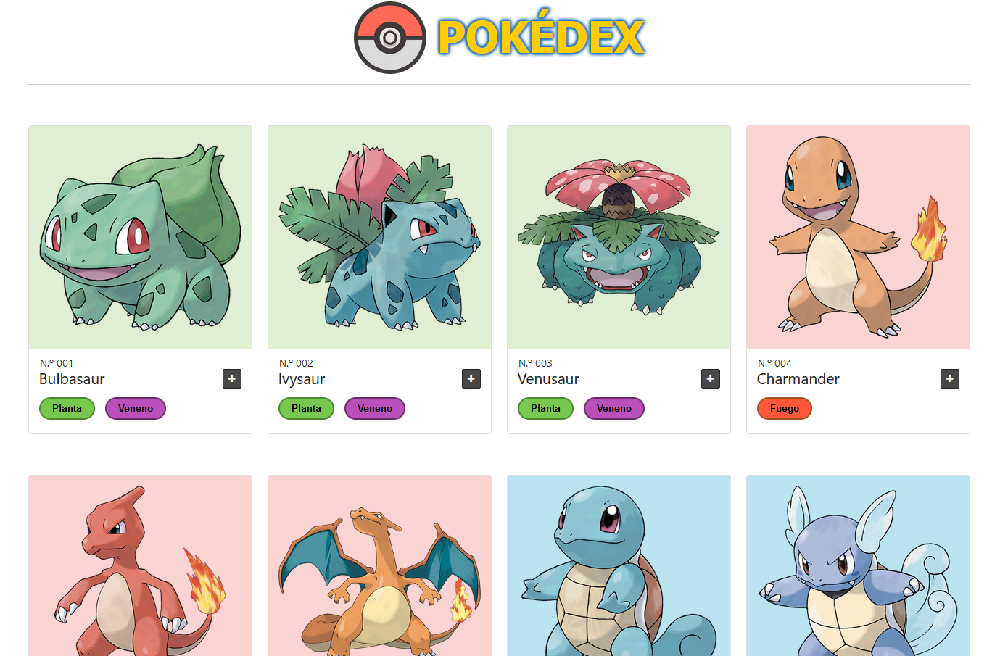
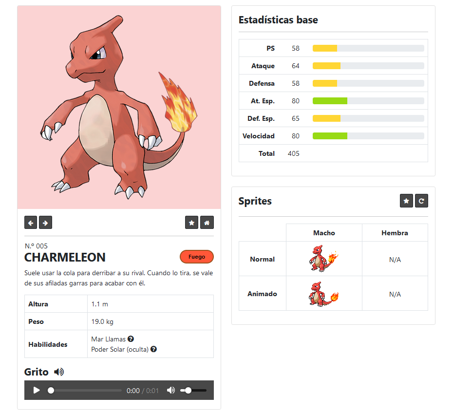

# POKÉDEX APP
Aplicación web hecha como hobby que consiste en una Pokédex que permite visualizar de diferentes maneras la información acerca de todos los Pokémon que existen hasta día de hoy. Cabe destacar que la aplicación no está completa y a lo largo del tiempo ser irá actualizando con nuevas funcionalidades o mejoras.

## Descripción 
La aplicación está compuesta por una vista en la que se muestra el listado completo de los Pokémon (formato de cartas). En cada carta, se visualizan la imagen del Pokémon y algunos datos básicos: id, nombre y tipos. 

Además del listado, forma parte de la aplicación la vista de detalle, a la que se puede acceder a través de cada carta de Pokémon haciendo clic en el botón "+" o encima de la imagen del Pokémon en cuestión. Dentro de la página de detalle, se muestran todos los datos referentes al Pokémon: id, nombre, tipos, habilidades, grito, cadena evolutiva, etc.

## Tecnologías utilizadas
- Frontend:
    - HTML.
    - JavaScript.
    - CSS.
    - [Bootstrap 5](https://getbootstrap.com/).
    - [Font Awesome 4](https://fontawesome.com/v4/).
- Backend:
    - [Python](https://www.python.org/).
    - [Flask](https://flask.palletsprojects.com/en/3.0.x/).
- Datos (guardados localmente y obtenidos a través de la [Pokéapi](https://pokeapi.co/)):
    - Archivos JSON.
    - Imágenes en formato PNG y GIF.

## Copyright notice / Aviso sobre derechos de autor
- All media contents within "static/pokemon/" folder are copyrighted by The Pokémon Company and its affiliates. This includes images, gifs, sounds... / Todos los archivos multimedia dentro de la carpeta "static/pokemon/" son propiedad de The Pokémon Company y sus afiliados. Esto incluye imágenes, gifs, sonidos...: [link](https://www.pokemon.com/)

- All pokemon images, sprites, cries and data inside "static/pokemon/" folder were downloaded through the URLs defined in Pokeapi service for each pokemon, evolution chain... / Todas las imágenes, sprites, gritos y datos de los pokemon se descargaron a través de los enlaces que se pueden consultar en la Pokeapi para cada pokemon, cadenas evolutivas...: [link](https://pokeapi.co/).

- "src/static/favicon.png" --> Image by '[Harisankar Sahoo]("https://pixabay.com/users/hsaart-8633812/?utm_source=link-attribution&utm_medium=referral&utm_campaign=image&utm_content=4657023")' from [Pixabay](https://pixabay.com//?utm_source=link-attribution&utm_medium=referral&utm_campaign=image&utm_content=4657023) / Imagen hecha por '[Harisankar Sahoo](https://pixabay.com/users/hsaart-8633812/?utm_source=link-attribution&utm_medium=referral&utm_campaign=image&utm_content=4657023)' y descargada de [Pixabay](https://pixabay.com//?utm_source=link-attribution&utm_medium=referral&utm_campaign=image&utm_content=4657023): [link](https://pixabay.com/vectors/pokemon-icon-design-symbol-sign-4657023/).

## Capturas

---

---

